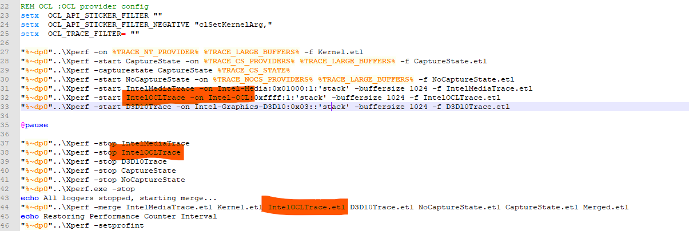

# Tracing config

### register events

- `register.reg` register the events
- copy `IntelOCLEtw.dll` to `%ProgramFiles%\Intel\Graphics\`

### replace intercept layer

replace `OpenCL.dll` to target App's folder.

### capture with config

sample capture CMD: 
- `Trace-IntelMedia3D_OCL.cmd`
- `Trace-Intel3D_OCL.cmd`

it would add GUID for capture, you can add them to any trace config prefered　sample as `Trace-IntelMedia3D_OCL.cmd`

